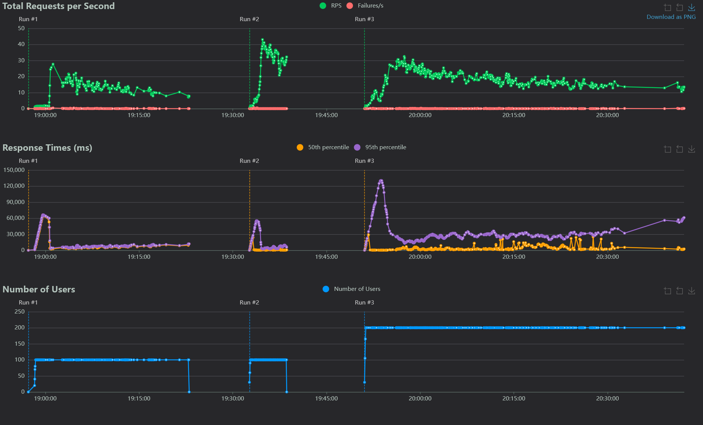
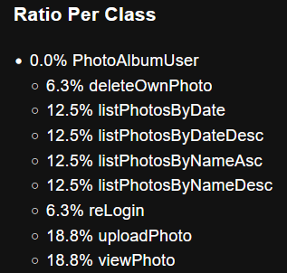

# Terheléspróba jegyzőkönyv - Locust és az automatikus felskálázódás bizonyítéka

## A mérés célja

Ennek a terheléspróbának az volt a célja, hogy igazolja: az alkalmazás nagy terhelés alatt képes automatikusan felskálázódni, majd amikor a terhelés csökken, vissza is tud skálázódni az eredeti állapothoz közeli értékre. A vizsgálatot Locust eszközzel végeztem el, OpenShift környezetben, a backend API-t célozva. A terhelést a `locust/locustfile.py` fájl írja le, a cél host pedig a `http://backend:5001` cím volt.

## A terhelés beállítása

A méréshez példaként 60 felhasználót és 10-es spawn rate-et használtam, a futási idő pedig körülbelül 5 perc volt. Ez elég ahhoz, hogy látható legyen a rendszer viselkedése terhelés alatt, ugyanakkor nem túl hosszú ahhoz, hogy a teszt kezelhetetlenné váljon.

## A terhelés által lefedett funkciók

A terheléspróba lefedte az alkalmazás fő funkcióit is. A Locust szkript először regisztrációt végez, majd bejelentkezik, ezután különféle módokon lekéri a fotólistát rendezéssel együtt, például dátum és név szerint, növekvő és csökkenő sorrendben is. Ezen felül a teszt feltölt képet, lekéri egy kép metaadatait, megnyitja a képfájlt, végül pedig saját fotót is töröl. Így a mérés nem csak egyetlen végpontot terhel, hanem a rendszer több fontos működési pontját is lefedi.

## A mérés menete

A mérés menete a gyakorlatban úgy nézett ki, hogy először ellenőriztem a kiinduló állapotot a Podok számát és kihasználtságát a Workloads -> Deployments nézetben. Ezután elindítottam a Locust terhelést a webes felületen. A terhelés futása közben ismét ellenőriztem a HPA állapotát és a Deploymentek replika számát, valamint az OpenShift felületén az Observe -> Horizontal Pod Autoscalers nézetet is figyeltem. Miután leállítottam a terhelést, megint megnéztem a Deploymentek állapotát, hogy látható legyen a visszaskálázódás is.

## A dokumentálandó bizonyítékok

A jegyzőkönyvben a szöveges összefoglaló alatt helyezem el a méréshez tartozó képeket. Ide kerül a Locust statisztika oldala, mert azon látszik a kérésarány, a válaszidő és az esetleges hibaarány is. Ugyanitt jelenik meg a HPA nézetről készült kép terhelés alatt, valamint a Deploymentek replika számát bemutató képernyőkép terhelés közben és terhelés után. Ezek a képek együttesen szolgálnak bizonyítékul arra, hogy a rendszer valóban képes volt automatikusan felskálázódni a megnövekedett terhelésre, majd vissza is tudott skálázódni, amikor a terhelés csökkent.

A fenti grafikonon látszik, hogy a terhelés felfutása után a rendszer stabilan képes volt kéréseket kiszolgálni, miközben a hibák száma végig alacsony maradt. A válaszidő görbéken induláskor megfigyelhető egy átmeneti tüske, majd a rendszer beáll egy egyenletesebb működésre. Ez arra utal, hogy a szolgáltatás terhelés alatt is működőképes maradt, és nem omlott össze a megnövelt felhasználószám mellett.

Ez a kimutatás azt mutatja, hogy a terhelés nem egyetlen végpontra koncentrálódott, hanem több művelet között oszlott meg. Jól látható, hogy a feltöltés és a megtekintés nagyobb arányban szerepel, de a törlés, újrabejelentkezés és a különböző listázási műveletek is jelen vannak. Emiatt a mérés az alkalmazás fő funkcióit valós felhasználási mintához közelítő módon terhelte.